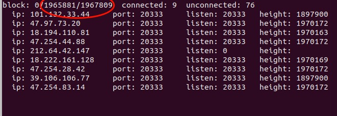
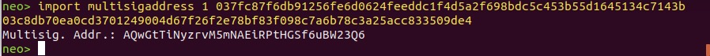
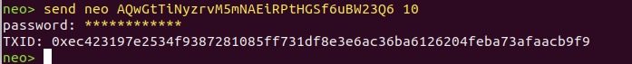
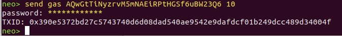

# 如何发送测试网NEO币 & GAS币

测试币申请需求来自 https://neo.org/Testnet/Create, 作为管理员,可在此处 [here](https://neo.org/testnet/list)查看完整的申请列表。如果还没有管理员账号，请向 chenzhitong@neo.org 申请.
发送完测试币之后，需[保存发送记录](#保存交易记录)，之后发送[通知邮件](#通知邮件)给用户，如收到用户问题，可参考[常见问题](#常见问题)

## 环境配置

转账可通过两种客户端实现，[NEO-CLI](#NEO-CLI) 和 [NEO-GUI](#NEO-GUI)，下面分别介绍通过NEO-CLI 以及NEO-GUI 客户端发送NEO以及GAS测试币.

### NEO-CLI

OS: Windows & Linux
#### 前提
1. 从NEO官方网站上下载 [Neo-cli](https://github.com/neo-project/neo-cli/releases) 客户端，目前支持操作系统**Linux**, **Win7**, **Win10** 

2. 下载 .Net core

3. 解压文件，应该是neo-cli命名的文件夹.

4. 打开命令行界面，来到neo-cli目录

5. 输入*dotnet neo-cli.dll* 进入neo客户端命令行界面

6. 输入*show state*，此时由于高度未同步，需要先完成同步操作

7. 下载离线 [申请包](http://sync.ngd.network/)，注意选择**测试网 Testnet**.

8. 将下载好的离线申请包放置neo-cli文件夹下

9. 此时命令行中的*show state*的高度将会明显加快

10. 当最后*show state*中三个高度数字相等时，表明同步完成

#### 步骤
NEO-CLI 完整命令行使用请参考http://docs.neo.org/zh-cn/node/cli/cli.html

1. 打开命令行界面，输入*dotnet neo-cli.dll* 进入neo客户端命令行界面

2. 打开钱包 open wallet <xxx.json>

   Example: *open wallet testnet2.json*

3. 用双方的公钥地址创建一方签名的合约地址： import multisigaddress <m> <pubkey 1> <pubkey 2><...> <pubkey m>   

   注意：其中m=1或2，在此种情况下，只需要创建1方签名的合约地址

   **Example**: neo> *import multisigaddress 1 037fc87f6db91256fe6d0624feeddc1f4d5a2f698bdc5c453b55d1645134c7143b  03c8db70ea0cd3701249004d67f26f2e78bf83f098c7a6b78c3a25acc833509de4*

   **Result**:  Multisig. Addr.: AQwGtTiNyzrvM5mNAEiRPtHGSf6uBW23Q6

   注意： 公钥地址用空格分开，037fc87f6db91256fe6d0624feeddc1f4d5a2f698bdc5c453b55d1645134c7143b为**NEO方**的公钥地址，03c8db70ea0cd3701249004d67f26f2e78bf83f098c7a6b78c3a25acc833509de4为**申请者**的公钥地址，生成的多方签名合约地址即为： AQwGtTiNyzrvM5mNAEiRPtHGSf6uBW23Q6

4. 转账到生成的合约地址：send <neo/gas> <multisig address> <neo/gas apply amount>

   **Example**: *send neo AQwGtTiNyzrvM5mNAEiRPtHGSf6uBW23Q6 10*

   **Result**: *TXID: 0xec423197e2534f9387281085ff731df8e3e6ac36ba6126204feba73afaacb9f9*

### NEO-GUI

操作流程也可参考https://docs.neo.org/docs/en-us/network/testnet.html

OS: Windows

#### 前提

1. 从NEO官方网站上下载 [NEO-GUI](https://github.com/neo-project/neo-gui/releases) 客户端，目前支持操作系统**Win7**, **Win10**(推荐)
2. 下载 .Net core
3. 解压文件，应该是neo-cli命名的文件夹.
4. 来到neo-cli目录，双击neo-cli.exe打开图形界面
5. 此时由于高度未同步，需要先完成同步操作
6. 下载离线 [申请包](http://sync.ngd.network/)，注意选择**测试网 Testnet**.
7. 将下载好的离线申请包放置neo-cli文件夹下

## 保存交易记录

测试币发放记录请在OneDrive上更新，https://vcagecom56739-my.sharepoint.com/:x:/g/personal/luxinyi_neo_org/EanJV73xA5hLotnBgRXDGO8B2dAPiWs-AvsE7cD-NOhpEQ?e=TUtkpF

## 通知邮件

发送完测试币之后，需要邮件通知申请者，测试币已经发出

### 步骤

1. 准备CSV表格（可用文本编辑，列之间用逗号隔开），从左至右依次填写
2. 脚本： [Script-Send_Emails.py](Script-Send_Emails.py)
3. 更改参数配置
  - line 10:  TESTNET_APPL_LIST = 'xxxxx.csv' 
  - line 23:  sender = 'xxxx@neo.org'

## 常见问题

- 原则上neo/gas发放量不超过5000/5000,但可酌情调整。
- 客户端未同步到最新高度，资产将不显示。

